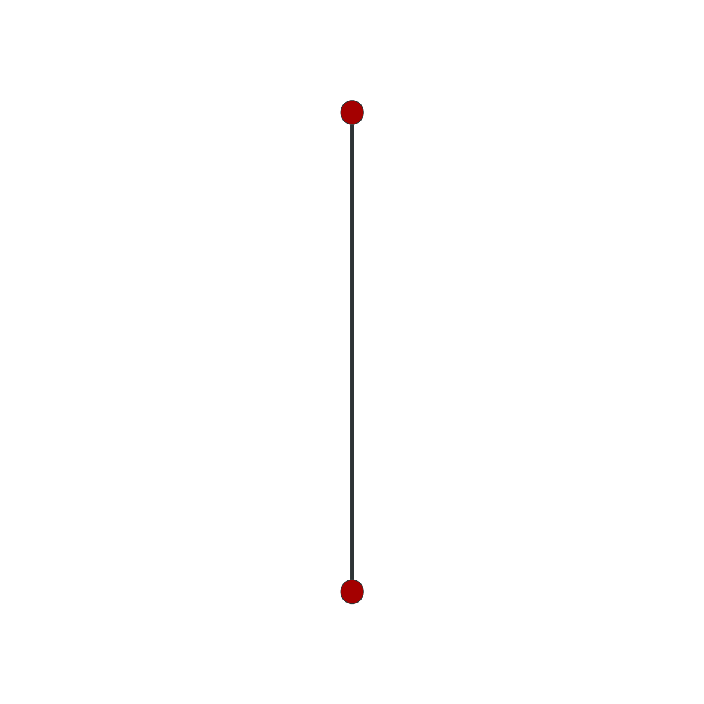
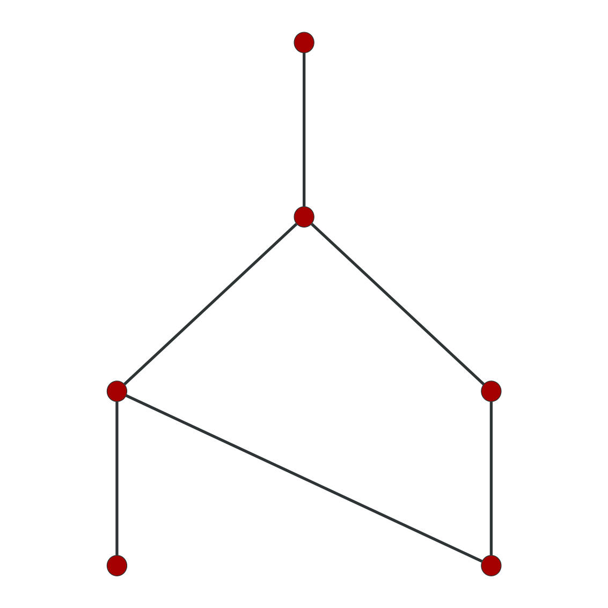
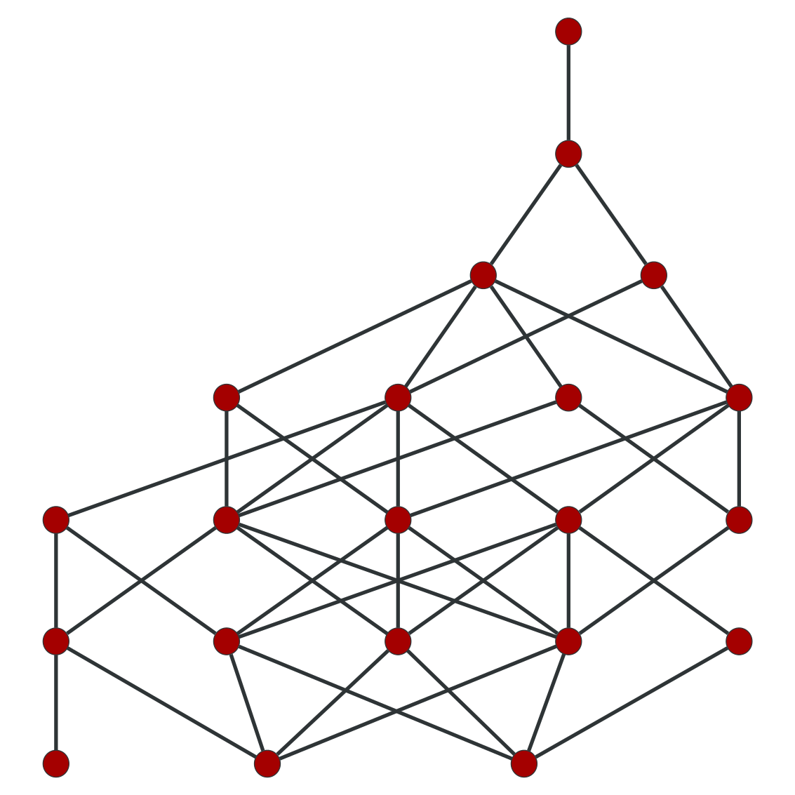
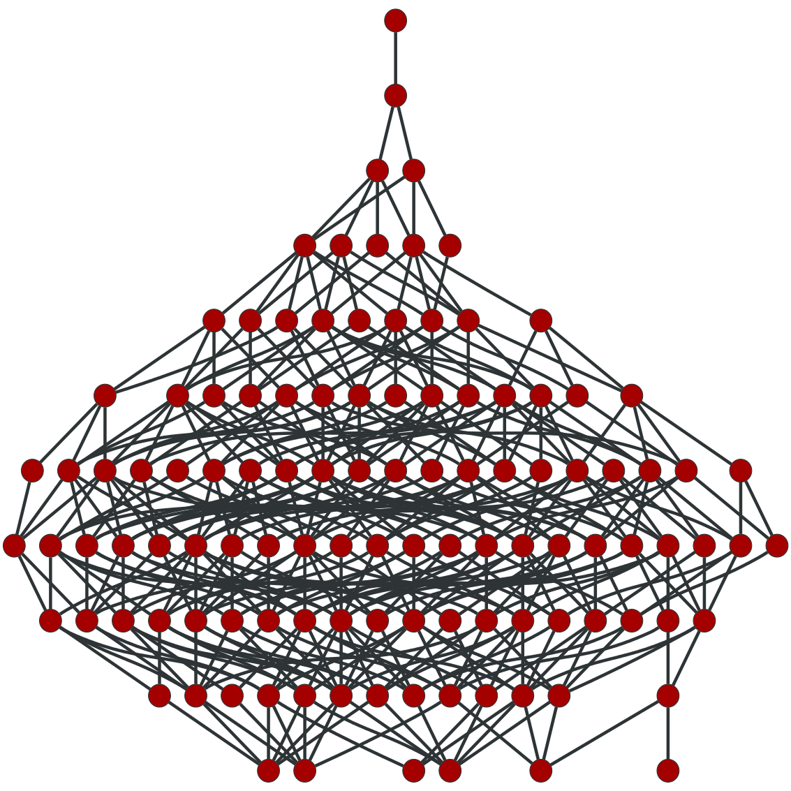
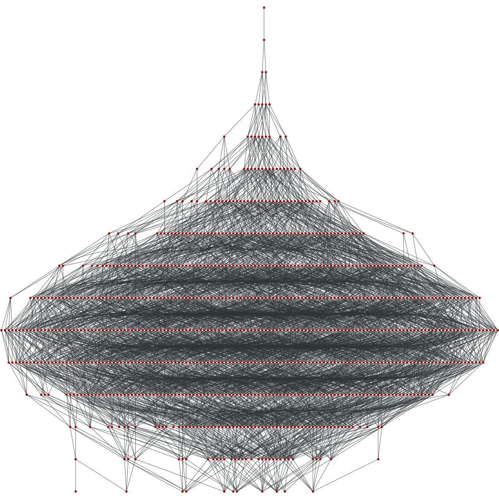

meta-graph
==========

Generating and documenting meta-graphs. Uses the [Encyclopedia of Finite Graphs](https://github.com/thoppe/Encyclopedia-of-Finite-Graphs) to generate small cases.

A meta-graph is a graph whose nodes are mapped one-to-one to all isomorphically distinct graphs of a given class and edges are joined by some rule.

The simple connected meta-graph of order n, M_n, maps each simple connected graph of order n to a vertex of M_n. There is an edge in M_n if, given two vertices v1, v2 \in M_n with associated graphs g1, g2, then g1 can formed from g2 from exactly one edge removal or addition.

======

Small examples

## Meta simple 3

## Meta simple 4

## Meta simple 5

## Meta simple 6

## Meta simple 7

